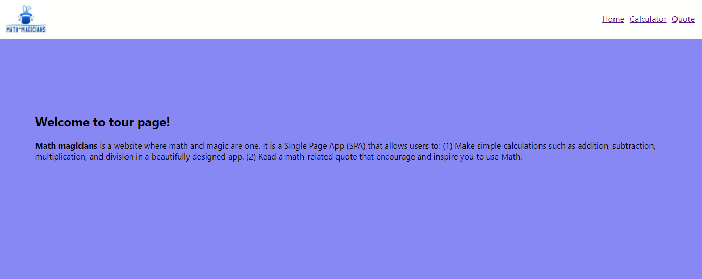
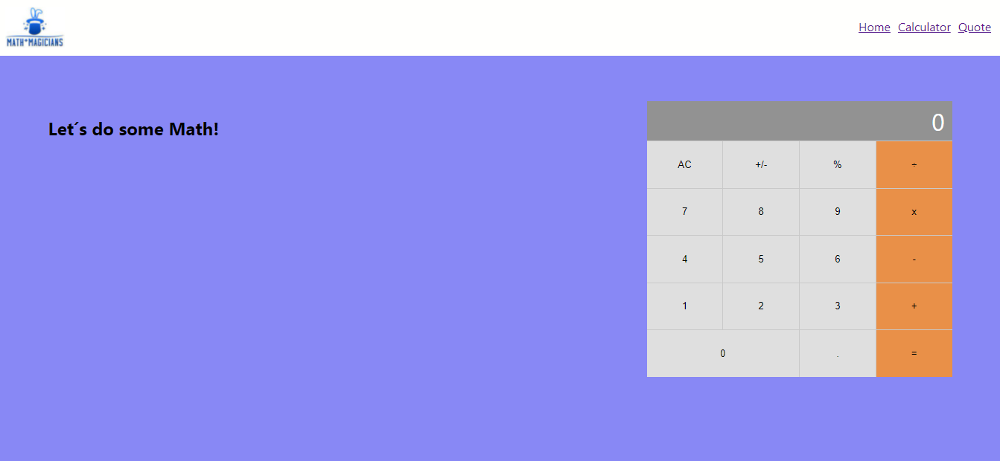
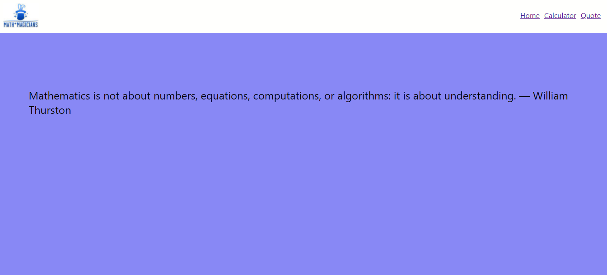

# Math Magicians

"Math magicians" is a website whose core functionality is a calculator.

## Built With

- HTML, CSS, JavaScript
- ReactJS
- VisualStudio Code, Git, & GitHub

## Live Demo

[Live Demo Link (TBA)](https://livedemo.com)

## Getting Started

To get a local copy up and running follow these simple example steps:

In your terminal, in the folder of your preference, type the following bash command to clone this repository: 
### `https://github.com/petumazo/math-magicians.git `

## Available Scripts

In the project directory, you can run:

### `npm start`

Runs the app in the development mode.\
Open [http://localhost:3000](http://localhost:3000) to view it in the browser.

The page will reload if you make edits.\
You will also see any lint errors in the console.

### `npm run build`

Builds the app for production to the `build` folder.\
It correctly bundles React in production mode and optimizes the build for the best performance.

The build is minified and the filenames include the hashes.\
Your app is ready to be deployed!

See the section about [deployment](https://facebook.github.io/create-react-app/docs/deployment) for more information.

## Authors

👤 **David Alvarez**

- GitHub: [@petumazo](https://github.com/petumazo)
- Twitter: [@petudeveloper](https://twitter.com/petudeveloper)
- LinkedIn: [David Alvarez](https://www.linkedin.com/in/david-alvarez-mazzo-777712143/)

## 🤝 Contributing

Contributions, issues, and feature requests are welcome!

Feel free to check the [issues page](../../issues/).

## Show your support

Give a ⭐️ if you like this project!

## Acknowledgments

- Hat tip to anyone whose code was used
- Inspiration
- etc

## 📝 License

This project is [MIT](./MIT.md) licensed.
